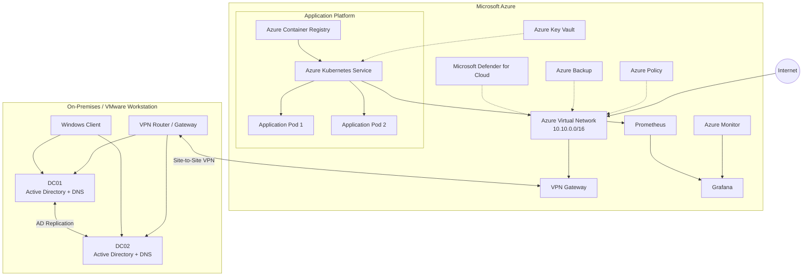

# Hybrid Infrastructure Project

> **Windows Server & Microsoft Azure — Enterprise Hybrid Infrastructure Lab**

[](#project-status)
[](#technology-stack)
[](#monitoring--observability)
[](#azure-workload)
[](#license)

## Overview

This project implements a small-scale **enterprise hybrid IT infrastructure** combining an on-premises Windows Server environment with Microsoft Azure.

The goal is not only to deploy working infrastructure, but to demonstrate how a real hybrid environment can be:

* securely connected
* centrally managed
* monitored
* highly available
* backed up
* governed
* cost-controlled
* tested against controlled failures

The project is implemented as part of a four-week infrastructure project focusing on **Windows Server, Azure, networking, identity, security, monitoring and high availability**.

---

## Architecture

The target architecture combines an on-premises Active Directory environment with an Azure-based application platform.



### High-Level Flow

```text
                         ┌──────────────────────┐
                         │       Internet       │
                         └──────────┬───────────┘
                                    │
                                    ▼
                         ┌──────────────────────┐
                         │   Microsoft Azure    │
                         │                      │
                         │  VNet                │
                         │   │                  │
                         │   ├── AKS             │
                         │   ├── ACR             │
                         │   ├── Monitoring     │
                         │   ├── Security       │
                         │   └── Backup         │
                         └──────────┬───────────┘
                                    │
                             Site-to-Site VPN
                                    │
                                    ▼
                         ┌──────────────────────┐
                         │     On-Premises      │
                         │                      │
                         │  VMware Workstation  │
                         │   │                  │
                         │   ├── DC01           │
                         │   ├── DC02           │
                         │   └── Windows Client │
                         └──────────────────────┘
```

---

## Project Goals

The infrastructure is designed around the following objectives:

### Hybrid Connectivity

Establish secure private connectivity between the on-premises network and Azure using a **Site-to-Site VPN**.

### Hybrid Identity

Synchronize on-premises Active Directory identities with **Microsoft Entra ID**.

### High Availability

Design selected infrastructure components without a single point of failure.

Examples:

* multiple Active Directory Domain Controllers
* multiple application replicas
* multiple AKS nodes
* Kubernetes health checks
* automatic workload recovery

### Monitoring & Observability

Centralize infrastructure and application metrics using:

* Prometheus
* Azure Monitor
* Grafana
* Log Analytics

### Security

Implement multiple security layers:

* Network Security Groups
* Microsoft Defender for Cloud
* RBAC
* Key Vault
* Azure Policy

### Backup & Recovery

Protect critical workloads and demonstrate recovery through controlled failure scenarios.

### Governance & Cost Management

Implement:

* Azure Policy
* resource tagging
* RBAC
* budgets
* cost monitoring

---

# Technology Stack

| Area                | Technology                       |
| ------------------- | -------------------------------- |
| Virtualization      | VMware Workstation               |
| On-Premises OS      | Windows Server                   |
| Directory Services  | Active Directory Domain Services |
| DNS                 | Windows DNS                      |
| Identity            | Microsoft Entra ID               |
| Hybrid Identity     | Microsoft Entra Connect          |
| Cloud Platform      | Microsoft Azure                  |
| Networking          | Azure VNet                       |
| Hybrid Connectivity | Site-to-Site VPN                 |
| Containers          | Docker                           |
| Container Registry  | Azure Container Registry         |
| Orchestration       | Azure Kubernetes Service         |
| Metrics             | Prometheus                       |
| Visualization       | Grafana                          |
| Cloud Monitoring    | Azure Monitor                    |
| Logs                | Log Analytics                    |
| Security            | Microsoft Defender for Cloud     |
| Secrets             | Azure Key Vault                  |
| Backup              | Azure Backup                     |
| Governance          | Azure Policy                     |
| Cost Management     | Azure Cost Management            |

---

# Network Architecture

## On-Premises Network

```text
Network: 10.0.0.0/24

DC01       10.0.0.10
DC02       10.0.0.11
Client     DHCP / Reserved
Gateway    10.0.0.1
```

## Azure Network

```text
VNet: 10.10.0.0/16

Management       10.10.1.0/24
AKS              10.10.2.0/24
Application      10.10.3.0/24
Private Endpoint 10.10.4.0/24
```

> The final address plan will be documented and updated during implementation.

---

# Hybrid Identity

The identity architecture connects the local Active Directory environment with Microsoft Entra ID.

```text
┌─────────────────────┐
│ On-Premises AD      │
│                     │
│ Users               │
│ Groups              │
│ Computers           │
└──────────┬──────────┘
           │
           │ Synchronization
           ▼
┌─────────────────────┐
│ Microsoft Entra ID  │
│                     │
│ Cloud Identity      │
│ Groups              │
│ Applications        │
└─────────────────────┘
```

The objective is to provide a consistent identity model across on-premises and cloud resources.

---

# Azure Workload

The primary cloud workload is a containerized application running on AKS.

```text
Developer
    │
    ▼
Docker Image
    │
    ▼
Azure Container Registry
    │
    ▼
Azure Kubernetes Service
    │
    ├── Application Pod 1
    ├── Application Pod 2
    └── Application Pod N
```

The application is intentionally lightweight. The focus of the project is the **infrastructure surrounding the application**, rather than application development itself.

---

# High Availability

High availability is tested through controlled failure scenarios.

## Application-Level Failure

```text
Pod 1 ──X
          \
           → Pod 2 continues serving traffic
```

Kubernetes should detect the failed workload and recreate it.

## Node-Level Failure

```text
Node 1 ──X

Node 2
 ├── Pod
 └── Application remains available
```

## Identity-Level Failure

```text
DC01 ──X

DC02
 ├── Authentication
 └── DNS
```

The objective is to demonstrate that selected component failures do not result in complete service interruption.

---

# Monitoring & Observability

Grafana is used as the central visualization layer.

```text
On-Premises
    │
    ├── Windows Metrics
    └── System Events
           │
           ▼
       Monitoring
           │
           ▼
        Grafana

Azure
    │
    ├── Azure Monitor
    ├── Prometheus
    └── AKS Metrics
           │
           ▼
        Grafana
```

### Planned Dashboard Metrics

* CPU utilization
* Memory utilization
* Disk utilization
* Network traffic
* Node availability
* Pod status
* Pod restarts
* Application requests
* Application latency
* Error rate
* Resource availability

---

# Security Architecture

Security is implemented using multiple layers.

```text
                    Internet
                       │
                       ▼
                Network Security
                       │
                       ▼
                 Azure Resources
                       │
          ┌────────────┼────────────┐
          ▼            ▼            ▼
       RBAC       Defender       Key Vault
                       │
                       ▼
                 Monitoring
```

Security controls include:

* least-privilege RBAC
* Network Security Groups
* Microsoft Defender for Cloud
* Azure Policy
* secure secret storage
* network segmentation
* monitoring and alerting

---

# Backup & Recovery

The project includes a recovery scenario rather than only enabling backup.

```text
Production Workload
        │
        ▼
      Backup
        │
        ▼
  Recovery Point
        │
        X
   Simulated Failure
        │
        ▼
      Restore
        │
        ▼
 Service Available
```

The recovery process will be documented with screenshots and test results.

---

# Governance

Azure Policy will be used to enforce selected organizational rules.

Example:

```text
Allowed Region:
    West Europe

Required Tags:
    Environment
    Owner
    Project
```

A policy that actively blocks an invalid configuration may be tested and documented.

---

# Cost Management

The project includes cloud cost controls.

Planned controls:

* Azure Budget
* Cost alerts
* Resource tagging
* Resource cleanup
* monitoring of active resources
* review of unnecessary cloud resources

---

# Failure Testing

One of the main goals is to demonstrate infrastructure behavior under failure.

| Test                             | Expected Result                   |
| -------------------------------- | --------------------------------- |
| Delete application Pod           | Kubernetes recreates Pod          |
| Stop/fail application Node       | Workload remains available        |
| Stop DC01                        | DC02 continues authentication/DNS |
| Application health check failure | Unhealthy workload is replaced    |
| Delete recoverable data          | Data restored from backup         |
| Invalid Azure deployment         | Azure Policy blocks deployment    |

Test results will be documented in:

```text
/tests/
```

---

# Documentation

All major implementation steps are documented continuously.

```text
docs/
├── architecture/
├── network/
├── identity/
├── security/
├── monitoring/
├── backup/
├── governance/
└── testing/
```

Screenshots and evidence are stored separately:

```text
screenshots/
├── on-prem/
├── azure/
├── monitoring/
└── testing/
```

---

# Project Status

| Phase               | Status         |
| ------------------- | -------------- |
| Planning            | 🟡 In Progress |
| GitHub Repository   | 🟡 In Progress |
| Network Design      | ⚪ Planned      |
| Windows Server      | ⚪ Planned      |
| Active Directory    | ⚪ Planned      |
| DNS                 | ⚪ Planned      |
| Domain Client       | ⚪ Planned      |
| Azure VNet          | ⚪ Planned      |
| Site-to-Site VPN    | ⚪ Planned      |
| Hybrid Identity     | ⚪ Planned      |
| ACR                 | ⚪ Planned      |
| AKS                 | ⚪ Planned      |
| High Availability   | ⚪ Planned      |
| Prometheus          | ⚪ Planned      |
| Grafana             | ⚪ Planned      |
| Security            | ⚪ Planned      |
| Backup & Recovery   | ⚪ Planned      |
| Governance          | ⚪ Planned      |
| Failure Testing     | ⚪ Planned      |
| Final Documentation | ⚪ Planned      |

---

# Repository Structure

```text
hybrid-infrastructure-project/
│
├── README.md
│
├── docs/
│   ├── architecture/
│   ├── network/
│   ├── identity/
│   ├── security/
│   ├── monitoring/
│   ├── backup/
│   ├── governance/
│   └── testing/
│
├── diagrams/
│
├── infrastructure/
│   ├── on-prem/
│   └── azure/
│
├── kubernetes/
│
├── monitoring/
│   ├── prometheus/
│   └── grafana/
│
├── scripts/
│   ├── powershell/
│   └── bash/
│
├── tests/
│
└── screenshots/
```

---

# Security Notice

No credentials, passwords, API keys, VPN pre-shared keys, tokens, certificates or other sensitive information should be committed to this repository.

Sensitive configuration must be stored securely and referenced through appropriate secret-management mechanisms.

---

# Project Documentation

Detailed implementation documentation will be added throughout the project.

* Architecture
* Network configuration
* Active Directory
* Azure configuration
* Hybrid connectivity
* Hybrid identity
* Kubernetes
* Monitoring
* Security
* Backup and recovery
* Governance
* Failure testing

---

# Final Objective

The final infrastructure should demonstrate a functional hybrid environment in which:

```text
                    ┌──────────────────────┐
                    │      USERS           │
                    └──────────┬───────────┘
                               │
                     Hybrid Identity
                               │
              ┌────────────────┴────────────────┐
              │                                 │
              ▼                                 ▼
       ┌──────────────┐                  ┌──────────────┐
       │ On-Premises  │◄─── VPN ────────►│    Azure     │
       │              │                  │              │
       │ AD + DNS     │                  │ AKS + ACR    │
       │ DC01 + DC02  │                  │ Application  │
       └──────────────┘                  └──────┬───────┘
                                               │
                          ┌────────────────────┼──────────────────┐
                          ▼                    ▼                  ▼
                     Monitoring             Security          Backup
                          │                    │                  │
                          └────────────┬───────┴──────────────────┘
                                       ▼
                                    Grafana
```

The result should be a **documented, monitored, secured and tested hybrid infrastructure**, rather than a collection of individually configured servers and cloud resources.

## License

This project is intended for educational and portfolio purposes.

controlled failure scenarios.

## Project Status

Phase 0 - Planning       [x]
Phase 1 - On-Prem        [ ]
Phase 2 - Active Directory [ ]
...
