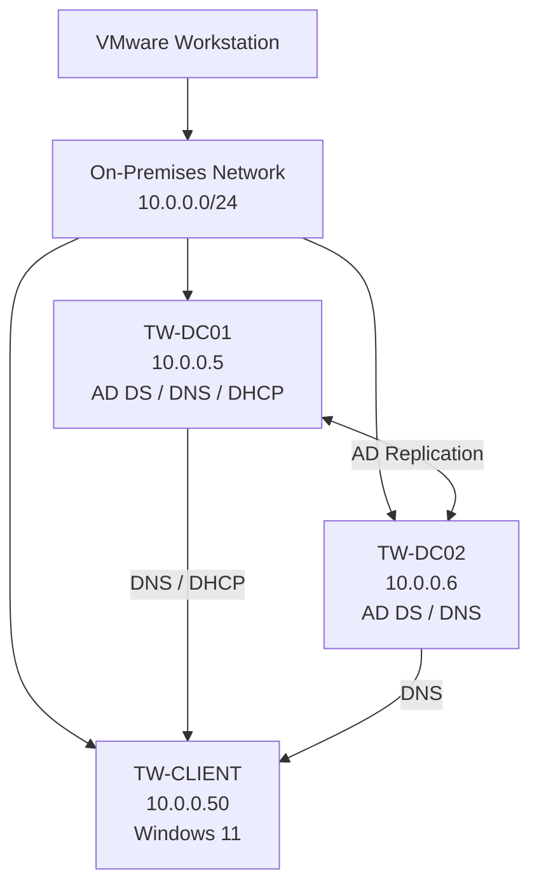
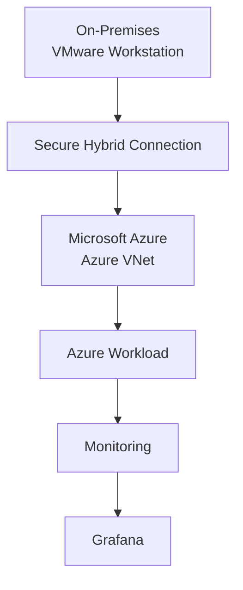

# Infrastructure Architecture

## Current On-Premises Architecture

```mermaid
flowchart TB

    VMware["VMware Workstation"]

    Network["On-Premises Network<br/>10.0.0.0/24"]

    DC01["TW-DC01<br/>10.0.0.5<br/>AD DS / DNS / DHCP"]

    DC02["TW-DC02<br/>10.0.0.6<br/>AD DS / DNS"]

    Client["TW-CLIENT<br/>10.0.0.50<br/>Windows 11"]

    VMware --> Network
    Network --> DC01
    Network --> DC02
    Network --> Client

    DC01 <--> |"AD Replication"| DC02

    DC01 --> |"DNS / DHCP"| Client
    DC02 --> |"DNS"| Client
```

## Planned Hybrid Architecture

```mermaid
flowchart TB

    OnPrem["On-Premises<br/>VMware Workstation"]

    Azure["Microsoft Azure<br/>Azure VNet"]

    Connection["Secure Hybrid Connection"]

    Workload["Azure Workload"]

    Monitoring["Monitoring"]

    Grafana["Grafana"]

    OnPrem --> Connection
    Connection --> Azure
    Azure --> Workload
    Workload --> Monitoring
    Monitoring --> Grafana
```
