# Hybrid Infrastructure — Final Architecture

> Enterprise-style hybrid infrastructure lab combining Windows Server, Microsoft Azure, Kubernetes, identity, monitoring, security, backup, governance, and resilience testing.

---

## Final Architecture

```mermaid
flowchart LR

%% =========================================================
%% ON-PREMISES
%% =========================================================

subgraph ONPREM["ON-PREMISES INFRASTRUCTURE"]
    direction TB

    VMWARE["VMware Workstation"]

    DC01["TW-DC01<br/>AD DS · DNS · DHCP<br/>10.0.0.5"]

    DC02["TW-DC02<br/>AD DS · DNS<br/>10.0.0.6"]

    CLIENT["TW-CLIENT<br/>Domain Joined<br/>10.0.0.50"]

    PFSENSE["TW-FW01 · pfSense<br/>Gateway 10.0.0.1"]

    VMWARE --> DC01
    VMWARE --> DC02
    VMWARE --> CLIENT
    VMWARE --> PFSENSE

    CLIENT -->|"DNS / Authentication"| DC01
    CLIENT -->|"Secondary DNS / Authentication"| DC02
end


%% =========================================================
%% IDENTITY
%% =========================================================

subgraph IDENTITY["IDENTITY"]
    direction TB

    ENTRA["Microsoft Entra ID"]

    CLOUDSYNC["Microsoft Entra Cloud Sync<br/>Provision on Demand validated"]
end

DC02 --> CLOUDSYNC
CLOUDSYNC --> ENTRA


%% =========================================================
%% HYBRID CONNECTIVITY
%% =========================================================

VPN["Site-to-Site IPsec VPN<br/>IKEv2 · AES256 · SHA256<br/>Configured"]

PFSENSE -.-> VPN


%% =========================================================
%% AZURE NETWORK
%% =========================================================

subgraph AZURENET["AZURE NETWORK · POLAND CENTRAL"]
    direction TB

    VNET["vnet-hybrid-prod<br/>10.10.0.0/16"]

    WORKLOAD["snet-workload<br/>10.10.1.0/24"]

    MGMT["snet-management<br/>10.10.2.0/24"]

    AKSSUBNET["snet-aks<br/>10.10.3.0/24"]

    GATEWAY["GatewaySubnet<br/>10.10.10.0/24"]

    VM["tw-app-01<br/>Ubuntu VM<br/>10.10.1.4"]

    NAT["nat-hybrid-workload<br/>Explicit Outbound Connectivity"]

    VNET --> WORKLOAD
    VNET --> MGMT
    VNET --> AKSSUBNET
    VNET --> GATEWAY

    WORKLOAD --> VM
    WORKLOAD --> NAT
end

VPN -. "Configured hybrid path" .-> GATEWAY


%% =========================================================
%% AKS PLATFORM
%% =========================================================

subgraph AKSPLATFORM["APPLICATION PLATFORM · AKS"]
    direction TB

    INGRESS["Application Routing Ingress<br/>Public Endpoint"]

    SERVICE["ClusterIP Service<br/>hybrid-api-helm"]

    HELM["Helm Release<br/>hybrid-api-helm"]

    HPA["Horizontal Pod Autoscaler<br/>Min 2 · Max 5<br/>CPU Target 50%"]

    NODE1["AKS Worker Node 1"]
    NODE2["AKS Worker Node 2"]

    POD1["Application Pod"]
    POD2["Application Pod"]

    INGRESS --> SERVICE

    SERVICE --> POD1
    SERVICE --> POD2

    HELM --> POD1
    HELM --> POD2

    HPA --> HELM

    NODE1 --> POD1
    NODE2 --> POD2
end

AKSSUBNET --> AKSPLATFORM


%% =========================================================
%% CONTAINER REGISTRY
%% =========================================================

ACR["Azure Container Registry<br/>acrhybridronak01<br/>Admin User Disabled"]

ACR -->|"AcrPull via Managed Identity"| AKSPLATFORM


%% =========================================================
%% SECURITY + IDENTITY
%% =========================================================

subgraph SECURITY["SECURITY & WORKLOAD IDENTITY"]
    direction TB

    SA["Kubernetes ServiceAccount<br/>hybrid-api-sa"]

    FIC["Federated Identity Credential<br/>fic-hybrid-api"]

    MI["Managed Identity<br/>id-hybrid-api"]

    KV["Azure Key Vault<br/>kv-hybrid-ronak01"]

    RBAC["Azure RBAC<br/>Least Privilege"]

    NSG["Network Security Group<br/>Restricted SSH"]

    SA --> FIC
    FIC --> MI
    MI -->|"Key Vault Secrets User"| KV
    RBAC --> MI
end

AKSPLATFORM --> SA
NSG --> VM


%% =========================================================
%% MONITORING
%% =========================================================

subgraph MONITORING["MONITORING & ALERTING"]
    direction TB

    PROM["Prometheus"]

    GRAFANA["Grafana"]

    ALERT["Grafana Alerting<br/>High CPU Alert"]

    WEBHOOK["Webhook Notification<br/>Validated"]

    PROM --> GRAFANA
    GRAFANA --> ALERT
    ALERT --> WEBHOOK
end

AKSPLATFORM --> PROM


%% =========================================================
%% BACKUP
%% =========================================================

subgraph BACKUP["BACKUP & RECOVERY"]
    direction TB

    RSV["Recovery Services Vault<br/>rsv-hybrid-prod"]

    RECOVERY["Recovery Points<br/>File-System Consistent<br/>Vault-Standard"]

    FILEREC["Linux File Recovery Test<br/>iSCSI Authentication Limitation"]

    RSV --> RECOVERY
    RECOVERY -.-> FILEREC
end

VM -->|"Azure Backup"| RSV


%% =========================================================
%% GOVERNANCE
%% =========================================================

subgraph GOVERNANCE["GOVERNANCE & COST MANAGEMENT"]
    direction TB

    TAGS["Resource Tags<br/>environment · project · owner"]

    POLICY["Azure Policy<br/>Require environment Tag"]

    COMPLIANCE["Policy Compliance<br/>100% · 16/16"]

    BUDGET["Monthly Budget<br/>20 EUR"]

    COST["Cost Analysis<br/>Cost Drivers Reviewed"]

    TAGS --> POLICY
    POLICY --> COMPLIANCE

    BUDGET --> COST
end


%% =========================================================
%% USER ACCESS
%% =========================================================

USER["External User / Tester"]

USER -->|"HTTP"| INGRESS


%% =========================================================
%% GOVERNANCE RELATIONSHIPS
%% =========================================================

POLICY -.-> VM
POLICY -.-> ACR
POLICY -.-> KV
POLICY -.-> AKSPLATFORM

BUDGET -.-> VM
BUDGET -.-> AKSPLATFORM
BUDGET -.-> RSV
BUDGET -.-> NAT


%% =========================================================
%% KNOWN LIMITATIONS
%% =========================================================

LIMITVPN["S2S VPN Limitation<br/>External student-network restriction"]

LIMITSYNC["Cloud Sync Limitation<br/>Azure Service Bus blocked"]

LIMITBACKUP["File Recovery Limitation<br/>iSCSI target authentication"]

VPN -.-> LIMITVPN
CLOUDSYNC -.-> LIMITSYNC
FILEREC -.-> LIMITBACKUP


%% =========================================================
%% STYLING
%% =========================================================

classDef onprem fill:#EAF2FF,stroke:#2563EB,stroke-width:2px,color:#0F172A;
classDef identity fill:#F3E8FF,stroke:#7C3AED,stroke-width:2px,color:#1E1B4B;
classDef network fill:#E0F2FE,stroke:#0284C7,stroke-width:2px,color:#082F49;
classDef compute fill:#ECFDF5,stroke:#059669,stroke-width:2px,color:#064E3B;
classDef security fill:#FFF7ED,stroke:#EA580C,stroke-width:2px,color:#431407;
classDef monitoring fill:#F0FDFA,stroke:#0D9488,stroke-width:2px,color:#134E4A;
classDef backup fill:#FDF2F8,stroke:#DB2777,stroke-width:2px,color:#500724;
classDef governance fill:#FEFCE8,stroke:#CA8A04,stroke-width:2px,color:#422006;
classDef external fill:#F8FAFC,stroke:#475569,stroke-width:2px,color:#0F172A;
classDef limitation fill:#FEF2F2,stroke:#DC2626,stroke-width:2px,stroke-dasharray:5 5,color:#450A0A;

class VMWARE,DC01,DC02,CLIENT,PFSENSE onprem;
class ENTRA,CLOUDSYNC identity;
class VNET,WORKLOAD,MGMT,AKSSUBNET,GATEWAY,NAT,VPN network;
class VM,INGRESS,SERVICE,HELM,HPA,NODE1,NODE2,POD1,POD2,ACR compute;
class SA,FIC,MI,KV,RBAC,NSG security;
class PROM,GRAFANA,ALERT,WEBHOOK monitoring;
class RSV,RECOVERY,FILEREC backup;
class TAGS,POLICY,COMPLIANCE,BUDGET,COST governance;
class USER external;
class LIMITVPN,LIMITSYNC,LIMITBACKUP limitation;
```



---

## Architecture Domains

The project is divided into several infrastructure domains.

| Domain | Main Components |
|---|---|
| On-Premises | VMware Workstation, TW-DC01, TW-DC02, TW-CLIENT, pfSense |
| Identity | Active Directory, Microsoft Entra ID, Entra Cloud Sync |
| Azure Networking | VNet, workload subnet, management subnet, AKS subnet, NAT Gateway |
| Container Platform | AKS, Helm, Kubernetes Service, Ingress, HPA |
| Container Registry | Azure Container Registry |
| Security | Key Vault, Workload Identity, Managed Identity, RBAC, NSG |
| Monitoring | Prometheus, Grafana, Grafana Alerting |
| Backup | Recovery Services Vault, Azure VM Backup |
| Governance | Resource Tags, Azure Policy |
| Cost Management | Budget, Alerts, Cost Analysis |

---

## On-Premises Environment

The on-premises infrastructure runs inside VMware Workstation.

```text
Network: 10.0.0.0/24
Gateway: 10.0.0.1

TW-DC01
10.0.0.5
AD DS / DNS / DHCP

TW-DC02
10.0.0.6
AD DS / DNS

TW-CLIENT
10.0.0.50
Domain Joined

TW-FW01
pfSense
10.0.0.1
```

Two Active Directory Domain Controllers provide redundancy for authentication and DNS.

---

## Azure Network

The Azure environment uses the following virtual network:

```text
vnet-hybrid-prod
10.10.0.0/16
```

Subnet design:

```text
snet-workload
10.10.1.0/24

snet-management
10.10.2.0/24

snet-aks
10.10.3.0/24

GatewaySubnet
10.10.10.0/24
```

The workload VM is:

```text
tw-app-01
Private IP: 10.10.1.4
```

The VM does not require a direct public IP for normal operation.

Explicit outbound access is provided through:

```text
nat-hybrid-workload
```

---

## Hybrid Connectivity

A Site-to-Site VPN configuration was created between:

```text
pfSense
    |
    v
Azure VPN architecture
```

The configuration used:

```text
IKEv2
AES256
SHA256
DH Group 14
```

The VPN configuration was completed, but the tunnel could not fully establish because the external student-network environment restricted required connectivity.

The VPN Gateway was later removed to prevent unnecessary Azure cost.

---

## Hybrid Identity

Hybrid identity was implemented with:

```text
Microsoft Entra Cloud Sync
```

Architecture:

```text
techwork.local
      |
      v
TW-DC02
Provisioning Agent
      |
      v
Microsoft Entra ID
```

Provision on Demand was successfully validated.

Continuous synchronization later entered quarantine because required outbound Azure Service Bus connectivity was blocked by the external environment.

---

## AKS Application Platform

The main cloud workload runs on:

```text
aks-hybrid-prod
```

The cluster contains:

```text
2 AKS worker nodes
```

The application is deployed through:

```text
Helm Release:
hybrid-api-helm
```

The final service configuration is:

```text
Service Type: ClusterIP
Ingress: Application Routing
Minimum Replicas: 2
Maximum Replicas: 5
CPU Target: 50%
```

The container image is stored in:

```text
acrhybridronak01
```

AKS pulls images from ACR using managed identity and the `AcrPull` role.

---

## Application Traffic Flow

```text
External User
      |
      v
Application Routing Ingress
      |
      v
ClusterIP Service
      |
  +---+---+
  |       |
  v       v
Pod 1   Pod 2
```

When the application experiences additional CPU load, the Horizontal Pod Autoscaler can increase replicas:

```text
2 Pods
  |
  v
3 Pods
  |
  v
4 Pods
  |
  v
5 Pods
```

After load decreases:

```text
5 Pods
  |
  v
2 Pods
```

---

## Workload Identity and Key Vault

The application uses passwordless authentication to Azure Key Vault.

```text
AKS Pod
   |
   v
Kubernetes ServiceAccount
hybrid-api-sa
   |
   v
Federated Identity Credential
fic-hybrid-api
   |
   v
Managed Identity
id-hybrid-api
   |
   v
Azure Key Vault
kv-hybrid-ronak01
```

The Managed Identity has:

```text
Key Vault Secrets User
```

at the Key Vault scope.

This eliminates the need to store static Azure credentials inside Kubernetes.

---

## Monitoring Architecture

Monitoring is implemented using:

```text
AKS
 |
 v
Prometheus
 |
 v
Grafana
 |
 v
Grafana Alerting
 |
 v
Webhook Notification
```

Monitoring validates:

```text
Node CPU
Node Memory
Pod CPU
Pod Memory
Resource Requests
Resource Limits
HPA Behavior
Application Workload
```

A high CPU alert was successfully tested through:

```text
Normal
  |
  v
Pending
  |
  v
Firing
```

Webhook notification delivery was also validated.

---

## Backup Architecture

The Azure VM is protected using Azure Backup.

```text
tw-app-01
    |
    v
Recovery Services Vault
rsv-hybrid-prod
    |
    v
Recovery Points
```

Validated components:

```text
VM Backup Protection
On-Demand Backup
File-System Consistent Recovery Point
Vault-Standard Recovery Point
```

Linux File Recovery was also tested.

The workflow progressed through:

```text
Recovery Script
      |
      v
Secure TCP Tunnel
      |
      v
Azure Backup Recovery Target
```

The final volume mount did not complete because iSCSI target authentication failed.

---

## Governance Architecture

All project resources use standard tags:

```text
environment = lab
project = hybrid-infrastructure
owner = ronak
managed-by = manual
cost-center = student-lab
```

Azure Policy enforces the required:

```text
environment
```

tag.

Validated compliance:

```text
16 / 16 compliant resources
100% compliance
0 non-compliant resources
```

---

## Cost Management

A monthly Resource Group budget is configured:

```text
Budget Name:
budget-hybrid-lab

Budget:
20 EUR
```

Alerts:

```text
Actual Cost 50%
Actual Cost 80%
Actual Cost 100%
Forecasted Cost 100%
```

Cost Analysis was used to identify major cost drivers and remove unnecessary resources.

---

## Resilience Validation

The following controlled failure tests were completed successfully:

| Failure Test | Result |
|---|---|
| Delete application Pod | PASSED |
| Kubernetes self-healing | PASSED |
| HPA scale-up 2 → 5 | PASSED |
| HPA scale-down 5 → 2 | PASSED |
| Ingress availability during Pod deletion | PASSED |
| Node scheduling disabled | PASSED |
| Pod rescheduled to healthy node | PASSED |
| Application availability during scheduling failure | PASSED |
| Node returned to Ready state | PASSED |

---

## Known Limitations

### Site-to-Site VPN

```text
Status:
Configured but not fully operational
```

Reason:

```text
External student-network restrictions
```

---

### Microsoft Entra Cloud Sync

```text
Provision on Demand:
Successful
```

Continuous synchronization:

```text
Limited by blocked Azure Service Bus connectivity
```

---

### Azure Backup File Recovery

```text
Backup:
Successful

Recovery Points:
Successful

File Recovery:
Partially validated

Final Volume Mount:
Not completed
```

The File Recovery process stopped during iSCSI target authentication.

---

## Final Architecture Status

```text
On-Premises AD DS                 VALIDATED
DNS                               VALIDATED
DHCP                              VALIDATED
Domain Client                     VALIDATED
Azure VNet                        VALIDATED
Hybrid VPN Configuration          CONFIGURED / LIMITED
Hybrid Identity                   PARTIALLY VALIDATED
Azure Container Registry          VALIDATED
Azure Kubernetes Service          VALIDATED
Helm Deployment                   VALIDATED
Horizontal Pod Autoscaler         VALIDATED
Prometheus                        VALIDATED
Grafana                           VALIDATED
Alerting                          VALIDATED
Azure Key Vault                   VALIDATED
Workload Identity                 VALIDATED
Azure RBAC                        VALIDATED
Network Security                  VALIDATED
Azure Backup                      VALIDATED
File Recovery                     LIMITED
NAT Gateway                       VALIDATED
Resource Tags                     VALIDATED
Azure Policy                      VALIDATED
Budget and Cost Alerts            VALIDATED
Failure Testing                   VALIDATED
```

---

## Final Result

The final infrastructure demonstrates a hybrid enterprise-style environment incorporating:

```text
Windows Server
Active Directory
Microsoft Entra ID
Azure Networking
Kubernetes
Container Registry
Monitoring
Alerting
Secret Management
Passwordless Authentication
RBAC
Backup
Governance
Cost Management
Resilience Testing
```

The project emphasizes not only successful deployments but also realistic troubleshooting, documented environmental limitations, security controls, cost awareness, and validated recovery behavior.